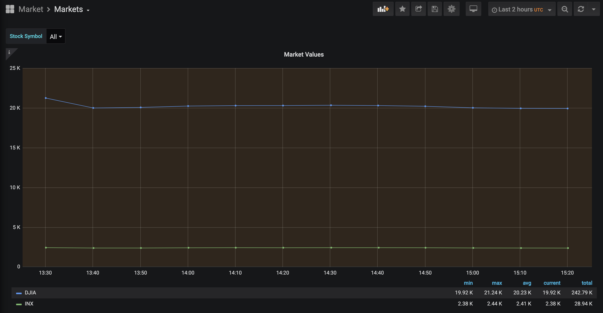

# Stock market recording

I have recently been experimenting with Grafana.
I wanted to graph the [Dow Jones Industrial Average](https://en.wikipedia.org/wiki/Dow_Jones_Industrial_Average) (DJIA) and [S&P 500 Index](https://en.wikipedia.org/wiki/S%26P_500_Index) in Grafana.

I needed to record the values regularly and found [Alpha Vantage](https://www.alphavantage.co/) which offers a free, limited API.
Specifically, Alpha Vantage has a [quote endpoint](https://www.alphavantage.co/documentation/#latestprice) that provides exactly the data that I needed.

The cron job listed at [market.cron](market.cron) will execute [market.py](market.py) every ten (10) minutes between 9:30AM and 4:00PM Monday through Friday (which is when the stock market is open in the United States).
The [market.py](market.py) script gets CSV output from the Alpha Vantage API, stores the CSV locally, parses out the latest price, and writes that data to InfluxDB.

The JSON for the Grafana dashboard that I ended up with is [available here](market_grafana.json) and here is a screenshot preview:

#### TODO

- If it was not apparent, the time zone of my server, database timestamp values, cron job, graphs, and dashboard are all in [Coordinated Universal Time](https://en.wikipedia.org/wiki/Coordinated_Universal_Time) (UTC).
I'm pretty sure the United States stock market (NYSE) opens and closes based on the _America/New_York_ ("Eastern US") time zone. I don't really have a plan for when Daylight Savings Time (DST) changes again, so that's going to be a problem I imagine?

- If the Alpha Vantage API fails for some reason, or rate limits my requests (more likely), the existing local CSV from the last time that the script ran will be used simply storing the older data into InfluxDB again.
I probably should just not write any data to the database if the latest price cannot be found, or if the API fails somehow.

- The Alpha Vantage API also offers quite a few other columns besides the latest price which I should look into storing (in InfluxDB as well?) for other uses.
For example, the CSV data return by the Alpha Vantage API for the Dow Jones Industrial Average (DJIA) on a random Wednesday morning [looks like this](DJIA.example.csv):

    symbol,open,high,low,price,volume,latestDay,previousClose,change,changePercent
    DJIA,20188.6895,20489.3301,19808.9004,19888.1406,252900423,2020-03-18,21237.3809,-1349.2402,-6.3531%
